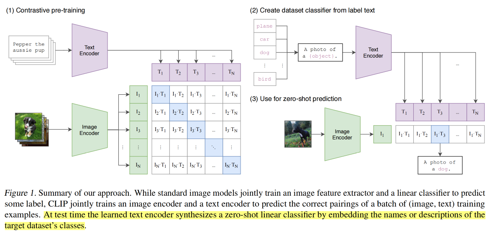
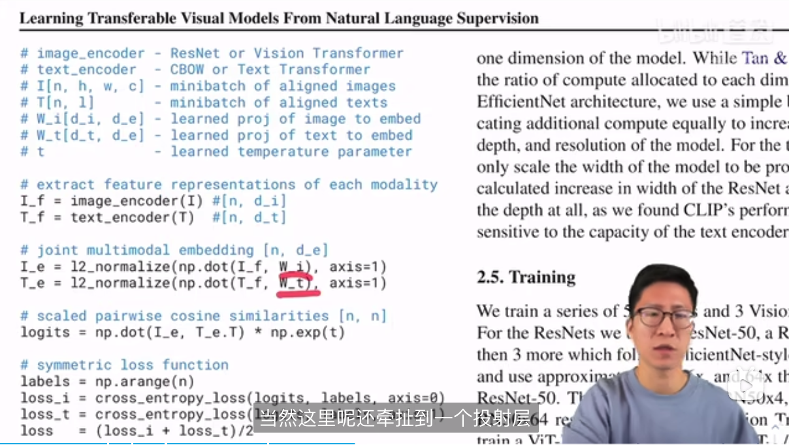
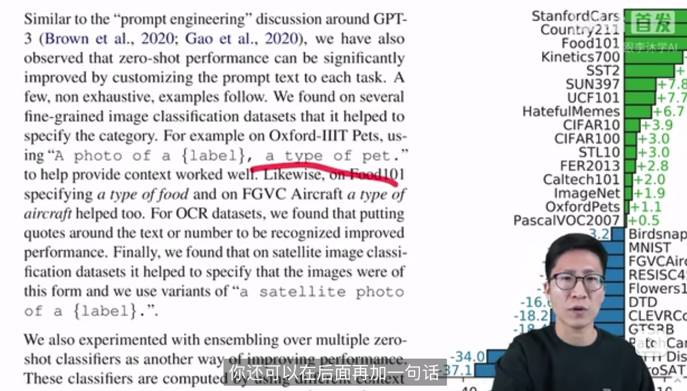
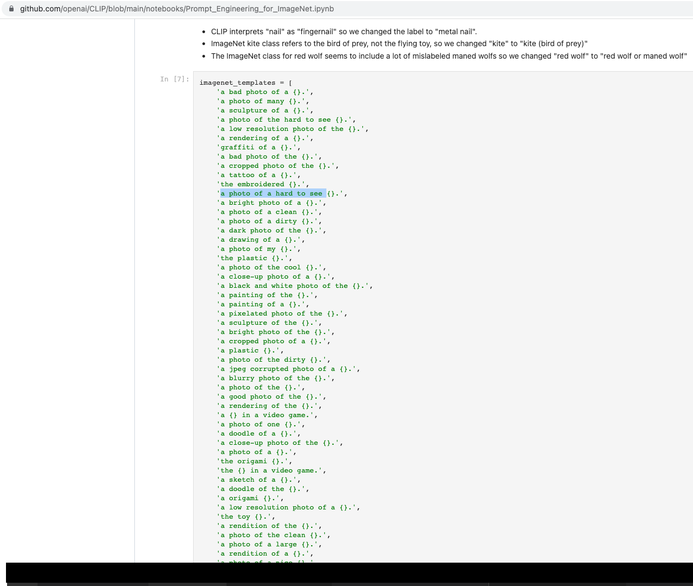
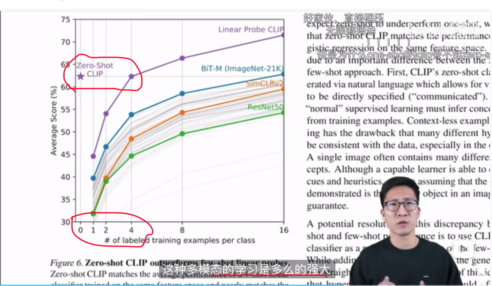

# openai2021: CLIP   
1. 吸睛点: zero-shot, 长尾数据, 标注难得, 主打一个泛化强 语义性!
 
2. How: 
    1.海量数据: 4亿条 img-txt数据对 
    2. 对比学习: 
     &nbsp;Encode image(ResNet, Vision Transformer) + text(Transformer)得到vector. vector间计算cosine similarity; 
    inference: [开放集下]的test image和label list分别过两个encoder, 定位到最match的那条text, 也就有了分类结果.
       
        伪代码:
           单模态到多模态的线性投射, 再做归一化. 另, 对角线上是正样本, img_i~text_i, so label是np.arange(). img, text分别算CE loss, 等权求sum 
    3. 练丹: 
    &nbsp;CE loss + Adam + random crop (混精度加速training); batch size: 3w+, vit-l-patch14, 32 epoch 
    4. Encode技巧:
        &nbsp;1. prompt engineering and ensemble, 构造提示文本, 给出上下文信息, 克服一些场景下的多义词.
        
         
        下游任务做ensemble的提示模板, paper里80个
        Q: 想一步segment anything可以怎么做?
        A: prompt以point, box的形式给, 交互式让大模型给出一团团较准的mask, 基于此标注同学做类别命令和标注边界微调; 
    5. 下游任务怎么续? 
    &nbsp;linear probe or finetune
        &nbsp;1. 抽特征 + linear probe. 冻住pretrain训个分类头就好. (CLIP用的这个, 主要还是自信迁移性强到你下游随便玩~ 都不咋需要调参.)
        &nbsp;2. 量和质都较高的数据, e2e调起来~  
    6. 说说limitation:
         &nbsp;1. 迁移能力在各数据集上大概和res50平手, 但离sota还有距离, 可继续补数据学! (预估计算量再x1000~)
         &nbsp;2. 虽然train模型没用上ImageNet等公开数据集, 但CLIP用了ta们做validation指导模型学习调参
        &nbsp;3. 细分类(数个数), 抽象概念(医学数据, 是否异常等应用)等任务做的不算很好
        &nbsp;4. 未来, 对比式+生成式结合, 生成图像标题. 不再需要自己去补"a photo of {}"这种类别语句了.  

3. other info: 
&nbsp;1. 多模态的威力, 语言和视觉结合更符合现实场景下人类的感知习惯. 用语言去描述(匹配)视觉看到的东西. 
 
