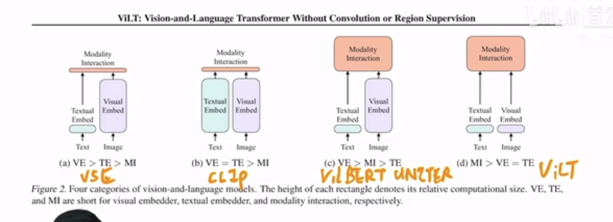
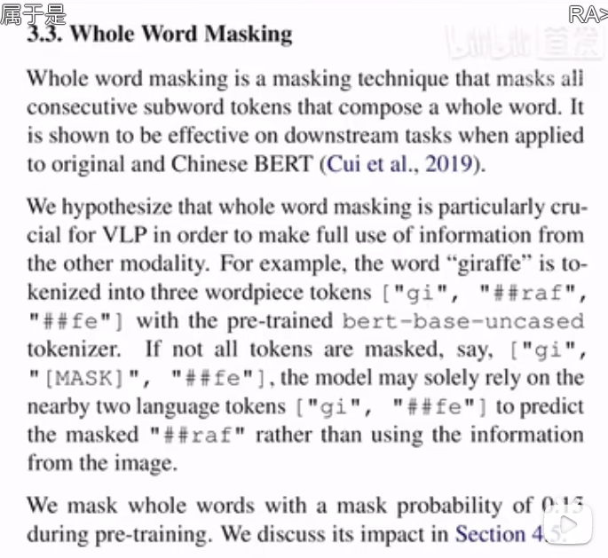
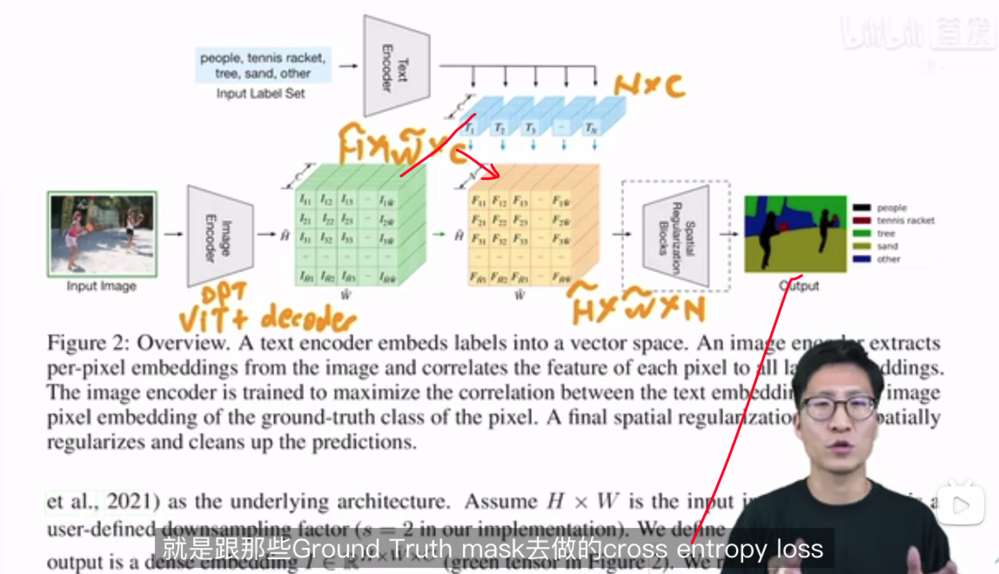
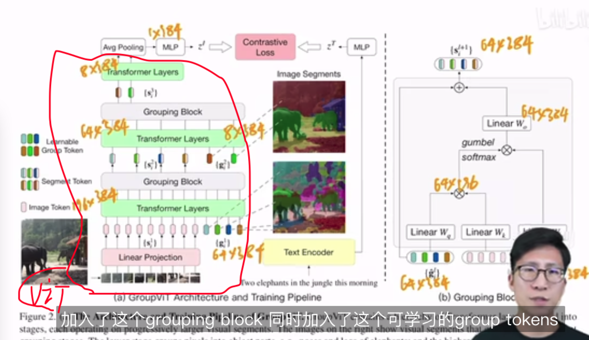
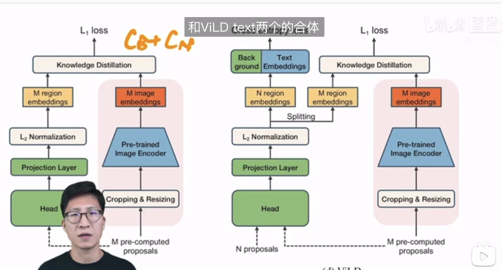
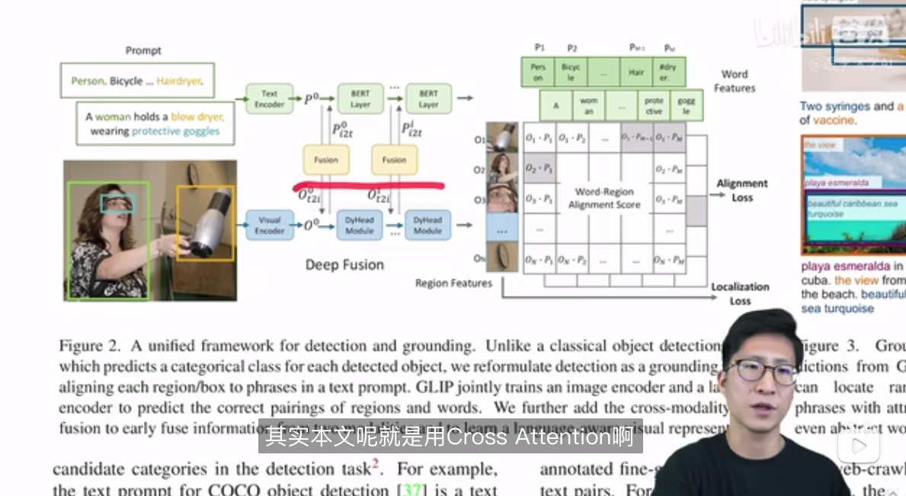
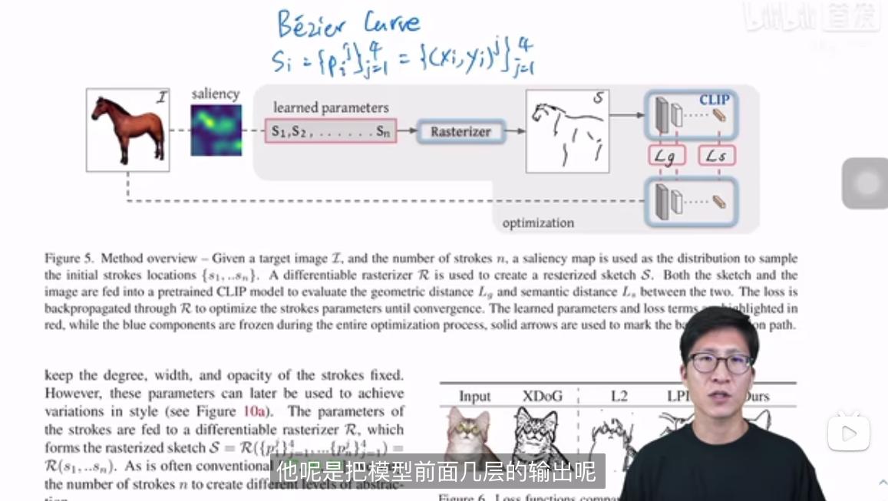
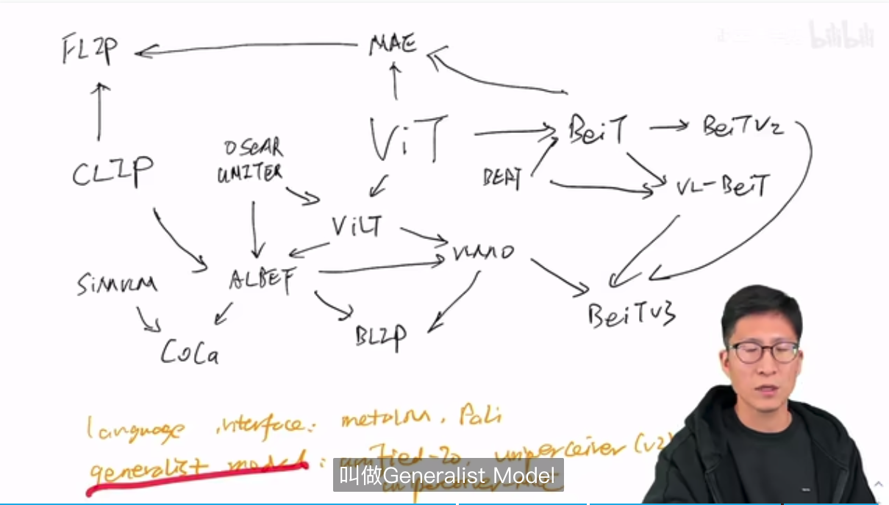
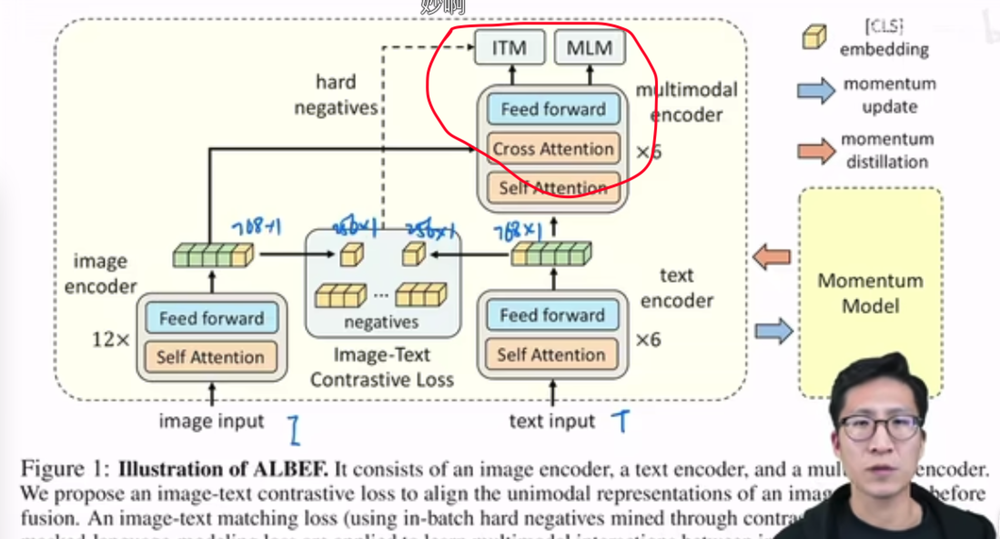

# paper reading 💪🏻🔋!!!

#### 2023.04.14 CLIP串讲1
《ViLT vision and language Transformer》
https://www.bilibili.com/video/BV14r4y1j74y/?vd_source=30d40bd09c8fa9d9f8cfab3eefe7c4da
视觉部分摒弃了region feature, running time减少, (虽然train的时间还是很长的..)
语言描述图像肯定是绕不开object的, 所以之前的很多方法在vision部分都做了目标检测工作,得到region box, 再抽region feature. 这部分就特别慢且还涉及nms之类的工作. 

1. vision部分类似是把ViT拿过来用了, 图像打成patch然后embedding. 

    region, 网格, ViLT的linear特征耗时对比. 
2. 另一个点就是多模态任务里也可以做data-aug了(对img做). 因为text, img两个模态得配对, 你img随便做aug的话,可能和text就不匹配了. ViLT怎么做呢? 
    1. randaugment, 但是把cutout和color inversion俩去掉, 意思就是对image不做遮挡和颜色变换, 那么image和text配对失败的概率就降低很多了..[只能说真的很去取巧...]
3. 再一个点: 
    1. whole word masking: 把单词一整个mask掉, 让模型不得不根据image那边的信息才能get到整个次是什么. (部分masking的话, 可能可以根据部分字母或中文的偏旁部首, 猜出这个word/字是什么.)
    
4. 消融实验:
    1. train 25k step和200k, 性能没差太多
    2. whole word masking有点用但是不多
    3. 对image做部分masking, 甚至没啥用
    4. 最强的还得是image augment!!!

#### 2023.04.14 CLIP串讲2
https://www.bilibili.com/video/BV1FV4y1p7Lm/?spm_id_from=pageDriver&vd_source=30d40bd09c8fa9d9f8cfab3eefe7c4da
CLIP改进合集
1. Segmentation: 
    1. language-driven semantic segmentation(有监督学习, 分割标注还是很贵的..clip是无监督的对比学习)
    
    2. GroupViT
    是个只需要text监督不需要分割mask标注的工作. 结果的mask可以分的很准(group block牛逼!)但分类不准. 学会了分割但没学会语义分割(用的也是clip的对比loss,但没用clip的参数).
    
    Vit的基础上加上grouping思想(object的一些点聚类扩散到完整mask这个object)
2. Detection
    1. ViLD: clip的两个Encoder都用上了, 用KL指导学习. m个proposal过clip(得到proposal embedding)也是提前算好再load进来的. <对存储要求还挺高..>  
    LVIS: 检测里的非常长尾的数据集
    
    2. GLIP: Grounded Language-Image Pre-training
    vision grounding: 给文本和图像, 把物体定位出来. (object detection: 给图像你给我把box找出来. 都是定位问题.)
    
    Deep Fusion用的是cross attention, 把文本图像的特征融合下, 再做两个模态间的相似度对比.
3. others:
    1. 素描生成: CLIPasso
    
    Lg loss: 计算teacher, student网络前几层的相似性. 网络前几层包含更多的长宽几何概念. 对物体的大小朝向啥的很有监督作用.
4. Video: 
    1. CLIP4clip
    2. ActionCLIP
5. 深度估计: 
    can language understand depth?
    
 

#### 2023.04.16  多模态串讲
https://www.bilibili.com/video/BV1Vd4y1v77v/?vd_source=30d40bd09c8fa9d9f8cfab3eefe7c4da

https://www.bilibili.com/video/BV1fA411Z772/?spm_id_from=333.788&vd_source=30d40bd09c8fa9d9f8cfab3eefe7c4da

总览全局: 

1. ALBEF: 视觉Encoder要复杂于文本Encoder.
    1. 红色圈内做image,text两个模态融合.
    2. momentum distillation: 动量蒸馏(为了克服noisy web data)
        1. onehot label形式的label对于对比学习这类loss并不友好. 网上爬的数据有时候一些负样本也有很多"正确信息"的. 一味惩罚这些负样本并不合适. 所以我们需要: multi-hot label or 它就是另外一个模型的输出(蒸馏就是这样的哟), 就比较好了.
        q不是onehot label而是distillation里的softmax score.
        2. hard negative (正样本附近找负样本)
2. BLIP: text, image怎么各自学习和融合, 在FFN中加以区别

用大模型洗自己的下游任务数据, 也许可以除噪声数据.
