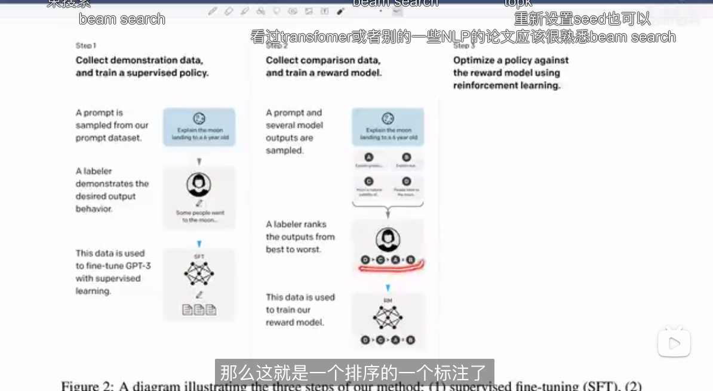

https://www.bilibili.com/video/BV1vM4y1U7b5/?spm_id_from=333.788&vd_source=30d40bd09c8fa9d9f8cfab3eefe7c4da
https://www.bilibili.com/video/BV1hd4y187CR/?vd_source=30d40bd09c8fa9d9f8cfab3eefe7c4da

1. chatgpt: RLHF (强化学习功不可没, 让model学出人想听的答案.)
    1. 先训一个模型: 给问题出答案, 且答案多个做个ranking   [纯model出文本部分]
    2. align: 这些答案让人排序, 判断好坏顺序给出标签(1~n), 这样就有了有标签数据训第二个模型: instructGPT(RLHF思想)   [人工降噪部分] 
    (甚至, 人的这个排序习惯, 也是可以用模型来学的..R_thea, 太可怕了, KL散度可以评估)
    
     
2. GPT4: input: 图像or文本, output: 文本